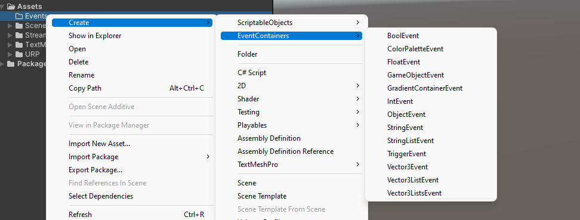

# Contributing

## Technical
Developers that like to contribute you must fork this repository and make your changes inside the package folder:

Packages/Netherlands3D/

Make sure pull requests with changes adhere to the following rules:

- The module you add has its own root folder in Packages/Netherlands3D/<YourModuleName>
- Folder structure of added feature must use the recommended [Unity package layout](https://docs.unity3d.com/Manual/cus-layout.html) (Where the root folder is your folder mentioned above)
- Modular ( minimal dependencies on other namespaces )
- Both desktop (PC) and WebGL platforms builds are supported
- Using code convention (see below)

Pull requests commits will be squashed into one message and merged after approval.

## ScriptableObject Event Containers

The Core package in Netherlands3D contains an Event system that we use to communicate between the standalone modules.

We recommend using these, or if you cant use them, using your own ScriptableObjects

This avoids having any Scene references to communicate between different modules, adhering to the modular plug-and-play nature of this this package. Non-programmer Unity users can create own connections between different modules and UI without touching any code.

This package allows you to create ScriptableObject Event Containers via a Right-click on the assets menu.



You can create an EventContainer by choosing a specific payload type.

Depending on the types the ScriptableObject contains a UnityEvent<type> as 'started'.

This example uses a BoolEvent container and shows how to add a listener, and invoke it.

```C#
[SerializeField] private BoolEvent boolEvent;

private void Start()
{
	boolEvent.started.AddListener(MyListener)
	boolEvent.started.Invoke(true);
}

private void MyListener(bool boolValue)
{
	Debug.Log( (boolValue) ? "Yes its true":"No it is false");
}
```

If you are missing a basic payload type, feel free to add it to the package and create a pull request.

## Code convention

All the project code and comments should be written in English. Content text is written in Dutch.

For C#/.NET coding conventions please refer to the Microsoft conventions:<br>
https://docs.microsoft.com/en-us/dotnet/csharp/programming-guide/inside-a-program/coding-conventions

For variable naming please refer to:<br>
https://docs.microsoft.com/en-us/dotnet/standard/design-guidelines/general-naming-conventions<br>

