Download en installeer Unity3D (<https://store.unity.com/>)

Open een nieuw 3D-project

Open de package-manager (window package manager)

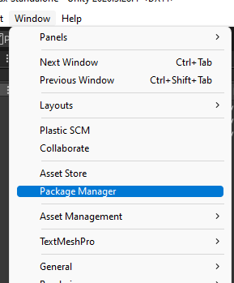

Klik op het + icoon in de linkerbovenhoek, kies voor "Add package from
git URL", vul daar in "
<https://github.com/Amsterdam/Netherlands3D.git?path=/Packages/Netherlands3D/>
" en klik op "Add"

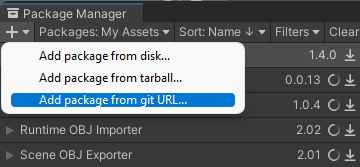
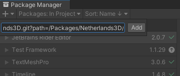{width="3.172253937007874in"
height="1.3347736220472441in"}

Unity gaat nu even iets voor zichzelf doen en laat daarna, als alles
goed gegaan is, de package Netherlands3D zien in de package-manager.

{width="4.057798556430447in"
height="2.810311679790026in"}

Onder het kopje "Samples" staat een lijst met pakketjes, dit zijn de
modules in netherlands3D die je kunt toevoegen aan je eigen project.

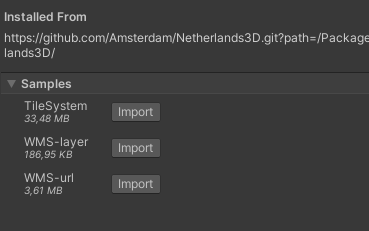{width="3.8442869641294837in"
height="2.4065857392825896in"}

We beginnen met het TileSystem. Dit is de module die het 3D-model van de
stad laat zien. Klik hiervoor op het knopje "Import" naast "TileSystem"

Unity heeft nu in de AssetFolder een mapje "Samples"aangemaakt met
daarin een mapje "Netherlands3D" en daarin een mapje met een
versienummer. In dit mapje staat alles wat je nodig hebt om het 3D-model
van de stad in het project te laten zien.

Unity heeft ook in de Console-window een berg foutmeldingen gegenereerd.
Dit komt omdat netherlands3D nog een extra package nodig heeft, genaamd
"Universal Render Pipeline".

## Universal Render Pipeline

Om de Universal Render Pipeline toe te voegen aan ons project gaan we
weer naar de packageManager en kiezen we in het pulldown-menu voor
"Unity Registry"

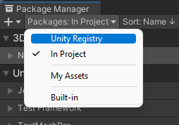

In de lijst met beschikbare packages selecteren we "Univeral RP" en
klikken op "Install"

{width="4.4934492563429576in"
height="3.0555653980752404in"}

Unity gaat vervolgens weer even aan de slag met importeren van de
package. Wanneer we nu in de console-window op "clear" klikken zouden er
geen foutmeldingen meer tevoorschijn moeten komen.

Nu maken we in de AssetFolder een nieuwe map aan met de naam
"RenderPipeline"

{width="3.3381463254593178in"
height="1.7589468503937007in"}

Geef een rechter-muisklik op deze nieuwe map en kies voor
CreateRenderingUniversal Render PipelinePipeline Asset (Forward
Renderer)

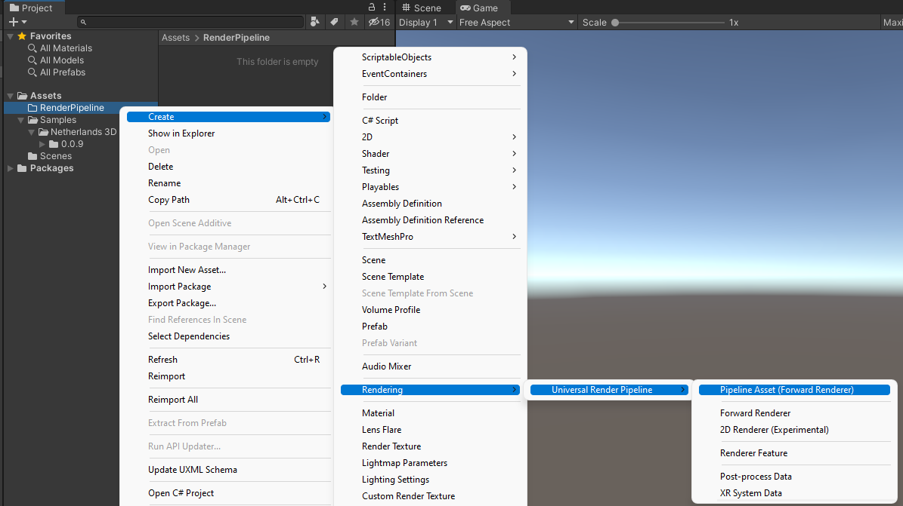

Unity geeft je nu de optie om de naam van dit nieuwe bestand te
wijzigen, maar dat is niet nodig. Geef een enter om de voorgestelde naam
te accepteren. Direct na het accepteren van de bestandnaam maakt Unity
nog een tweede bestand aan.

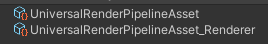{width="2.792055993000875in"
height="0.45839676290463693in"}

De laatste handeling die we moeten doen is aan Unity vertellen dat deze,
zojuist gemaakt bestandjes, gebruikt moeten worden door de Universal
Render Pipeline. Dit doen we in de project Settings ( Edit project
Settings.

In het project settings menu kiezen we in de linker kolom voor
"Graphics"

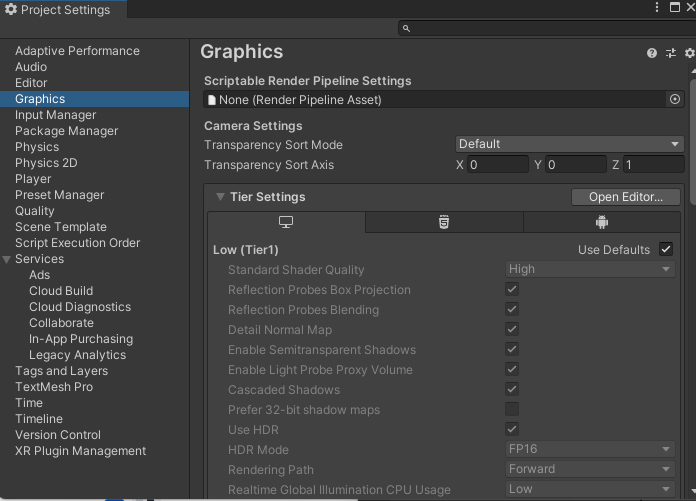{width="4.208741251093613in"
height="3.0299037620297464in"}

Boven in het Graphicsmenu klikken we op het rondje naast het invulveld
bij Scriptable Render Pipeline Settings.

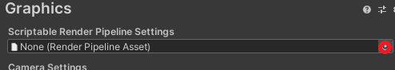

In het menuutje dat opent dubbelklikken we op het bestandje dat we
zojuist hebben aangemaakt.

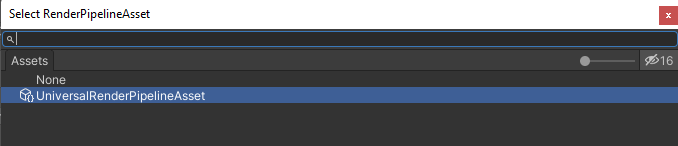

## TileSystem gebruiken

Om het tilesystem in actie te zien gaan we in de assetsFolder naar de
eerder geimporteerde Sample. In deze sample openen we de map "Scenes"

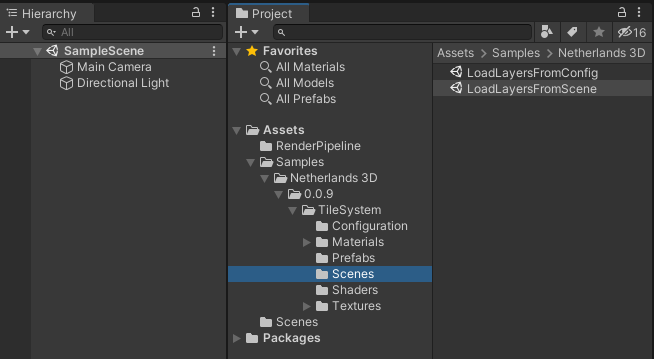{width="4.07750656167979in"
height="2.2378641732283464in"}

Vervolgens slepen we het bestand "LoadLayersFromScene" naar de
hierarchy.

{width="4.045745844269466in"
height="2.2726104549431323in"}

Om een goed beeld te kunne krijgen willen we de Main Camera nog even
verplaatsen. Dit doen we door in de Hierarchy de Main Camera aan te
klikken

{width="2.333659230096238in"
height="0.8542858705161854in"}

En vervolgens in de inspector de Position en Rotation aan te passen.

{width="4.298555336832896in"
height="3.3830424321959756in"}

Nu we toch in de Inspector voor de camera bezig zijn zetten we ook onder
het kopje "Camera", "Projection", "Clipping plane" de afstand voor Far
even van 1000 op 6000.

Klik vervolgens op "Play", et voila, we zien het 3D-model van Amsterdam.
