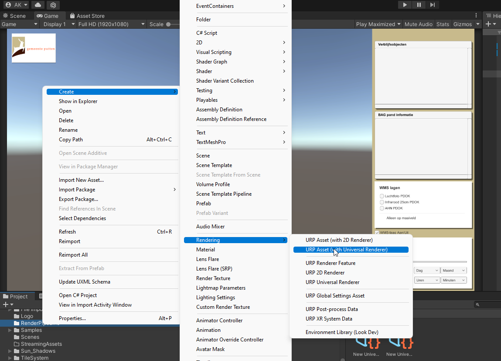
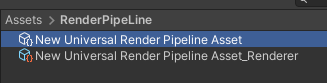
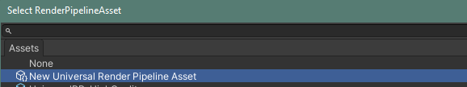

# Beginnen met Netherlands3D in Unity

## Git installeren

Zorg om te beginnen dat Git is geinstalleerd op het systeem.

Git is te downloaden vanaf https://gitforwindows.org/

Installatie met de standaard opties is voldoende. Herstart je systeem na de installatie.

## Unity installeren

Download en installeer Unity3D via <https://unity.com/download>

Je download daarmee de 'Unity Hub'. Vanuit deze Hub kan je verschillende versies van Unity downloaden.

'Sign in' met een bestaand Unity account, of maak eerst een nieuw account aan via 'Create account' en doe dan 'Sign in'

Ga eventueel akkoord met het activeren van een 'personal license'.

Kies in het 'Install Unity Editor' scherm rechtsonderin 'skip installation'. Wij willen namelijk een specifieke versie gaan installeren.

Installeer via 'Installs / Install Editor' de LTS (long term service) versie 2020.3.*

Maak na het installeren in de Hub een nieuw Unity project aan via 'Projects / New Project' en kies als template '3D Core'.

Het project wordt vervolgens automatisch geopend in Unity.

## In Unity

Open in Unity de package-manager (window package manager)

Klik op het + icoon in de linkerbovenhoek, kies voor "Add package from git URL", vul daar in "<https://github.com/Amsterdam/Netherlands3D.git?path=/Packages/Netherlands3D/>" en klik op "Add".

Unity gaat nu even iets voor zichzelf doen en laat daarna, als alles goed gegaan is, de package Netherlands3D zien in de package-manager.

Onder het kopje "Samples" staat een lijst met pakketjes, dit zijn de modules in netherlands3D die je kunt toevoegen aan je eigen project.

We beginnen met het TileSystem. Dit is de module die het 3D-model van de stad laat zien. 
Klik hiervoor op het knopje "Import" naast "TileSystem".

Unity heeft nu in de Assets map een mapje "Samples" aangemaakt met daarin een mapje "Netherlands3D" en daarin een mapje met een
versienummer. In dit mapje staat alles wat je nodig hebt om het 3D-model van de stad in het project te laten zien.

Nu maken we in de Assets map een nieuwe map aan met de naam "RenderPipeline".

Geef een rechter-muisklik op deze nieuwe map en kies voor CreateRenderingUniversal Render PipelinePipeline Asset (Forward Renderer)

Unity geeft je nu de optie om de naam van dit nieuwe bestand te wijzigen, maar dat is niet nodig. Geef een enter om de voorgestelde naam te accepteren. Direct na het accepteren van de bestandnaam maakt Unity nog een tweede bestand aan.

De laatste handeling die we moeten doen is aan Unity vertellen dat deze, zojuist gemaakt bestandjes, gebruikt moeten worden door de Universal
Render Pipeline. Dit doen we in de project Settings ( Edit project Settings. In het project settings menu kiezen we in de linker kolom voor "Graphics".)

Boven in het Graphicsmenu klikken we op het rondje naast het invulveld bij Scriptable Render Pipeline Settings.

In het menuutje dat opent dubbelklikken we op het bestandje dat we zojuist hebben aangemaakt.

## TileSystem gebruiken

Om het tilesystem in actie te zien gaan we in de assetsFolder naar de eerder geimporteerde Sample. 
In deze sample openen we de map "Scenes".

Vervolgens slepen we het bestand "LoadLayersFromScene" naar de hierarchy.

Om een goed beeld te kunnen krijgen willen we de Main Camera nog even verplaatsen. Dit doen we door in de Hierarchy de Main Camera aan te klikken:

En vervolgens in de inspector de Position en Rotation aan te passen.

Nu we toch in de Inspector voor de camera bezig zijn zetten we ook onder het kopje "Camera", "Projection", "Clipping plane" de afstand voor Far even van 1000 op 6000.

Klik vervolgens op **"Play"**, et voila, we zien het 3D-model van Amsterdam.
