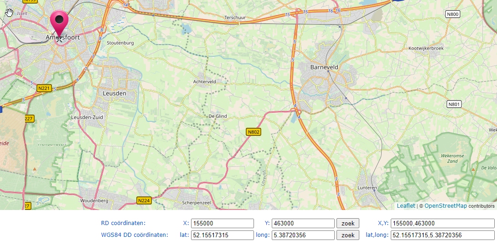
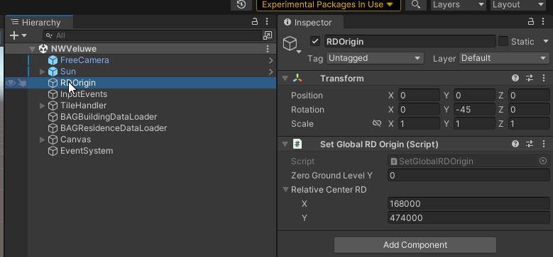
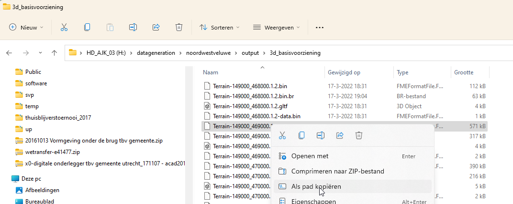
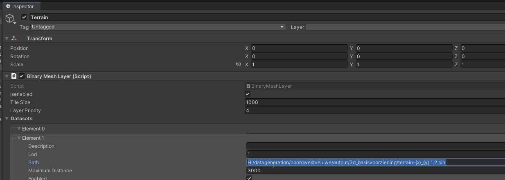

# Eigen data koppelen in Unity

## RD-coördinaat kiezen

Om je eigen data te koppelen moet je eerst een relatief RD-coördinaat bepalen binnen je eigen gebied. Het is makkelijk om hiervoor deze website te gebruiken: (https://www.msimons.nl/osm/). Klik hiervoor op een centraal punt binnen je gebied en rond het getal af in het venster rechtsonderin

kopieer of onthoudt deze getallen, om ze later in Unity in te vullen.

## Relatief coördinaat instellen in Unity

Open je nieuwe project in Unity en zoek in de Hierachy naar 'RDOrigin'. Vul dan het geselecteerde coördinaat in onder tab 'inspector', in bovenstaand geval X 155000 en Y 463000.

## Eigen data koppelen in Unity

Ga in de verkenner naar het pad waar de eigen data is opgeslagen (dat kan een usb-stick, externe harddisk, of webserver locatie zijn) en kopieer het pad van een voorbeeld ".bin" bestand.

en plak deze in de inspector onder het kopje 'Dataset' bij 'Path'

Wijzig de coördinaten in {x} en {y}, zoals hierboven te zien is en wijzig alle \ in /. Selecteer en kopieer deze regel voor een eventueel ander LOD niveau (voor gebouwen en 3D Basisvoorziening 2020)

Wijzig dan alleen het lod getal in de regel naar de gewenste.

Herhaal deze handeling ook voor de gebouwen (hier zelfs twee keer voor verschillende LOD's) en wanneer alle paden correct zijn ingevuld, kan je op play drukken. Als het goed is zie je dan de terreinen en gebouwen van je eigen gebied in beeld. Het kan zijn dat de camera nog niet helemaal goed staat. Kijk daarvoor in de handleiding 'Camera.md'