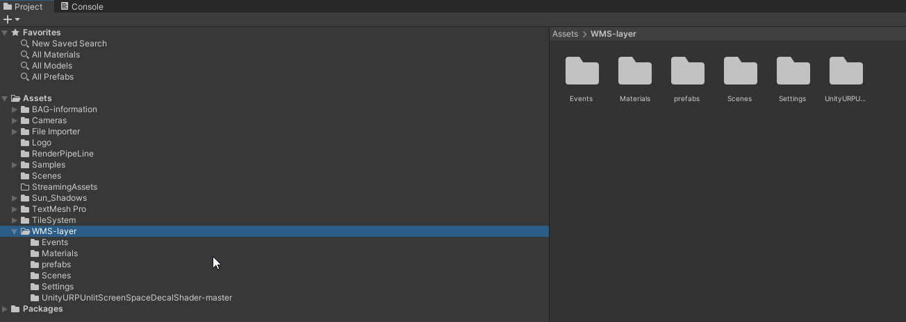
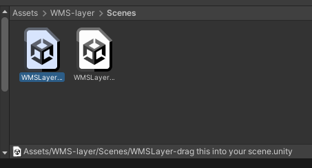
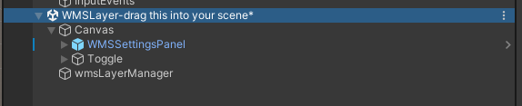
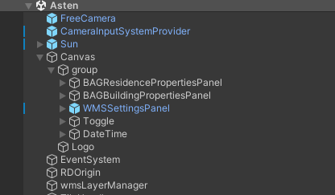
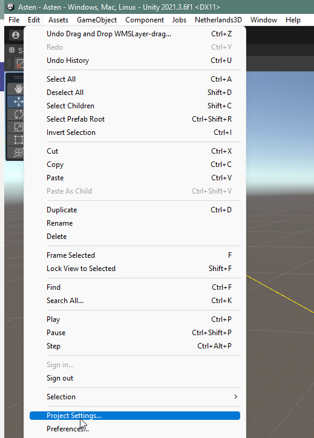
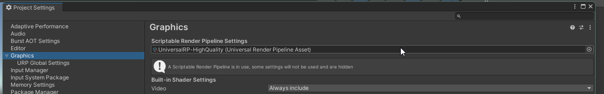

# WMS functionaliteiten toevoegen

## Werkwijze

We hebben de mogelijkheid gebouwd om WMS services (pixel gebaseerde api) binnen Netherlands 3D in te laden. Hiervoor is de sample WMS-layer beschikbaar in de package. Importeer deze en sleep de map op de assets map in Unity (hiermee voorkom je dat bij updates de laag en eigen instellingen wordt overschreven).

Ga naar de map scenes en sleep onderstaande scene in de hierarchy

Sleep vervolgens de items uit het Canvas van de ingesleepte scene, naar het canvas in de hoofdscene. Doet dit ook met de wmsLayerManager, maar sleep deze in de root.

Het enige wat nu nog moet gebeuren is de Renderpipeline instellingen wijzigen. Open de project settings via het edit menu van Unity.

En zoek naar de graphics instellingen.

Klik op het bolletje helemaal rechts en kies voor de UniversalRP-HighQuality pipeline asset.

Sluit dit venster en probeer de functie uit door op play te drukken.

